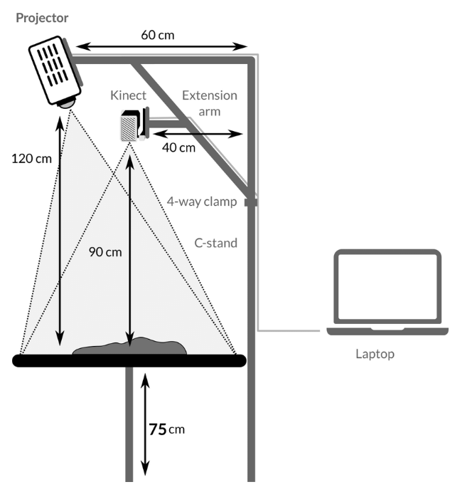

# SarndBoxExplorer

This is a tutorial on how to implement SARndBox 2.6 no Ubuntu 16, originally found at https://arsandbox.ucdavis.edu, the files were saved and copied here just in case the project would become discontinued.

## Requirements:

- A computer, prefererably with a dedicated graphics card, running the GNU/Linux Ubuntu 16 Operating System;
- A Microsoft Kinect 1.0 depth sensor. The software used by SARndbox (Kinect 3D Video Package) is compatible with all three first-generation Kinect models (Kinect for Xbox 1414, 1473, and Kinect for Windows), as well as the Kinect for Xbox One;
- A digital data projector with a digital video interface, such as HDMI, DVI, or DisplayPort;
- A sandbox so that the Kinect sensor and projector can be installed above it;
- Sand.
- Vrui version 4.6 build 005 or newew --> https://arsandbox.ucdavis.edu/technical-resources/downloads/vrui-vr/ --> http://idav.ucdavis.edu/~okreylos/ResDev/Vrui/Vrui-4.6-005.tar.gz
- Kinect 3D Video Capture Project version 3.7 or newer --> https://github.com/KeckCAVES/Kinect --> https://github.com/KeckCAVES/Kinect/archive/master.zip

## 1) Install VRUI

```shell
sudo apt-get install freeglut3-dev libv4l-dev libxi-dev libxrandr-dev zlib1g-dev libgl1-mesa-dev mesa-common-dev libudev-dev libpng-dev libjpeg-dev libtiff5-dev libtiff-dev libasound2-dev libspeex-dev libdc1394-22-dev libopenal-dev libdbus-1-dev libbluetooth-dev # .h needed files
sudo apt-get install build-essential # C++ compilator
sudo apt install xorg-dev # X Window System (X11)
sudo apt-get install libglew-dev libsdl2-dev libsdl2-image-dev libglm-dev libfreetype6-dev # sub deps
cd Vrui-4.6-005
make
sudo make install
```

If you are running on different OS, some error msg may appear during compiling, here I list some of them and the correspondent solution:

```shell
# Libudev library does not exist on host system 
sudo apt install libudev-dev # Libudev library exists on host system

# RawHID library disabled
sudo apt install libudev-dev # RawHID library enabled

# Multithreaded rendering disabled
# Default GL font directory: /usr/local/share/Vrui-4.6/GLFonts
# PNG image file format enabled
sudo apt install libpng-dev

# JPG image file format enabled
sudo apt install libjpeg-dev

# TIFF image file format disabled
sudo apt install libtiff5-dev # sudo apt install libtiff-dev # n funcionou

# ALSA sound2-und device support disabled
sudo apt install libasodev # ALSA sound device support enabled

# SPEEX speech compression support disabled
sudo apt install libspeex-dev # SPEEX speech compression support enabled

# Video4Linux2 video device support enabled
sudo apt install libv4l-dev

# FireWire DC1394 video device support disabled
sudo apt install libdc1394-22-dev # FireWire DC1394 video device support enabled  

# Theora video codec support enabled
sudo apt install libtheora-dev

# Spatial sound using OpenAL disabled
sudo apt install libopenal-dev # Spatial sound using OpenAL enabled

# Swapgroup support for Vrui windows disabled
# Support for screen saver inhibition via DBus disabled
sudo apt install libdbus-1-dev # Support for screen saver inhibition via DBus enabled

# Vrui will save screenshots in PNG format
# Support for spatial audio disabled
sudo apt install libopenal-dev # Support for spatial audio enabled

# Support to save screen captures in Ogg/Theora format enabled
# Support for multitouch screens enabled
# Support for named video outputs enabled
# LatencyTester vislet disabled (missing udev library)
sudo apt install libudev-dev # LatencyTester vislet for Oculus DK1 latency tester enabled

# Using global per-user configuration file .config/Vrui-4.6/Vrui.cfg
# Event device support for joysticks disabled
# Bluetooth support (for Nintendo Wii controller) disabled
sudo apt install libbluetooth-dev # Bluetooth support (for Nintendo Wii controller) enabled
```

Run Example program

```shell
cd Vrui-4.6-005/ExamplePrograms
make
./bin/ShowEarthModel
```


## 2) Install Kinect

```shell
cd Kinect-master
make
# ERROR: Vrui was not built with libusb-1 support.
  sudo apt-get install libusb-1.0-0-dev 
  cd ../Vrui-4.6-005
  sudo make uninstall # rebuild Vrui with libusb
  make clean          # rebuild Vrui with libusb
  make                # rebuild Vrui with libusb
  sudo make install   # rebuild Vrui with libusb
  cd ../Kinect-master
  make
  ./bin/KinectUtil list
```

## 3) Structure



## 4) Install SARndbox

```shell
cd SARndbox-master/
make
sudo make install
```

## 5) Operation 

- The augmented reality sandbox receives depth information scanned by the Kinect 360 sensor;
- Then, this information is processed by a set of three open-source software programs on the computer:
  - Kinect 3D Video Capture v3.7: Transforms the sensor captures into a matrix with depth values;
  - Augmented Reality Sandbox (SARndbox) v2.6: Continuously processes the numerical data from the depth matrix by:
    - Inverting them to height values;
    - Assigning a color value to the various height values of the matrix elements, transforming them into pixels;
  - VR toolkit v4.6.5: Displays a window on the computer screen with the previously processed 3D model.
- Then, this window is expanded to the projector’s view, which has the same framing and aspect ratio as the Kinect and the sandbox (3:4 or 75x100 cm).
